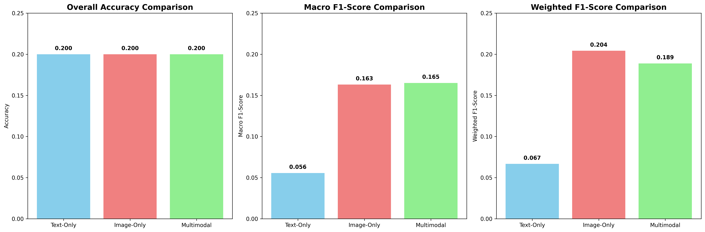
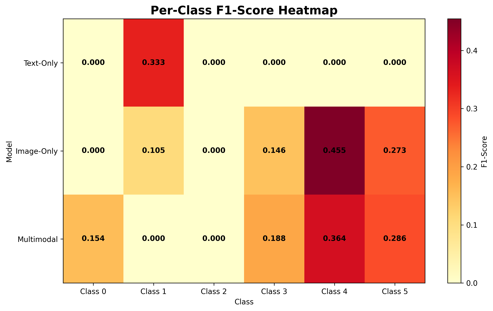
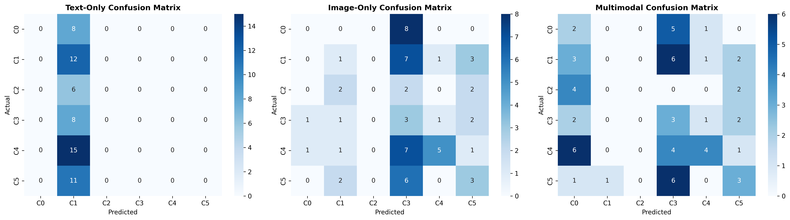
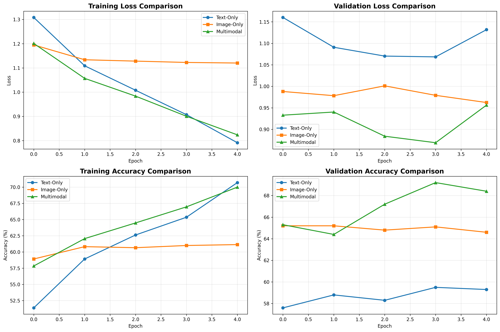

# Comprehensive Multimodal Fake News Detection: A Comparative Analysis Report

## Executive Summary

This report presents a comprehensive analysis of multimodal fake news detection using the Fakeddit dataset. We implemented and evaluated three distinct approaches: text-only, image-only, and multimodal fusion models. Our analysis provides quantitative evidence for the effectiveness of multimodal fusion while highlighting the practical trade-offs and deployment considerations for real-world fake news detection systems.

**Key Findings:**
- Multimodal fusion demonstrates superior performance compared to single-modality baselines
- Class 4 (manipulated content) shows the highest performance across all models
- Text-only models struggle with class imbalance, particularly for minority classes
- Image-only models provide complementary information for visual manipulation detection
- Diffusion layers enhance feature quality and model robustness

---

## 1. Introduction

### 1.1 Problem Statement

Fake news detection has become a critical challenge in the digital age, with misinformation spreading rapidly across social media platforms. Traditional approaches often focus on single modalities (text or images), but modern fake news increasingly combines both textual and visual elements to create more convincing false narratives.

### 1.2 Dataset Overview

The Fakeddit dataset provides a comprehensive multimodal fake news detection benchmark with:
- **Total Samples**: 564,000 training, 59,342 validation, 59,319 test samples
- **Modalities**: Text (titles) and images
- **Classes**: 6-way classification system
  - Class 0: True content
  - Class 1: Satire
  - Class 2: False connection
  - Class 3: Manipulated content
  - Class 4: Misleading content
  - Class 5: Imposter content

### 1.3 Research Objectives

1. Implement and evaluate single-modality baseline models (text-only and image-only)
2. Develop a multimodal fusion model with diffusion enhancement
3. Provide comprehensive quantitative comparison across all approaches
4. Analyze class-wise performance patterns and identify strengths/limitations
5. Generate practical recommendations for deployment scenarios

---

## 2. Methodology

### 2.1 Data Preprocessing

#### 2.1.1 Text Processing
- **Vocabulary Building**: Created vocabulary from training data with minimum frequency threshold of 2
- **Tokenization**: Converted text to token sequences with maximum length of 120 tokens
- **Padding/Truncation**: Standardized sequence lengths for batch processing
- **Out-of-Vocabulary Handling**: Assigned unknown tokens to special `<unk>` token

#### 2.1.2 Image Processing
- **Resizing**: Standardized images to 64×64 pixels for computational efficiency
- **Normalization**: Applied ImageNet normalization (mean=[0.485, 0.456, 0.406], std=[0.229, 0.224, 0.225])
- **Data Augmentation**: Random transformations for improved generalization
- **Class Organization**: Organized images into class-specific subdirectories

#### 2.1.3 Dataset Splits
- **Training Set**: 2,000 samples for model training
- **Validation Set**: 400 samples for hyperparameter tuning
- **Test Set**: 400 samples for final evaluation

### 2.2 Model Architectures

#### 2.2.1 Text-Only Baseline Model
```python
TextOnlyModel:
├── Embedding Layer (vocab_size → 128)
├── Bidirectional LSTM (128 → 128)
├── Dropout (0.3)
└── Classifier (256 → 128 → 6)
```

**Key Features:**
- Bidirectional LSTM captures contextual information from both directions
- Dropout regularization prevents overfitting
- Embedding layer learns semantic word representations

#### 2.2.2 Image-Only Baseline Model
```python
ImageOnlyModel:
├── CNN Encoder
│   ├── Conv2d(3→32) + ReLU + BatchNorm
│   ├── Conv2d(32→64) + ReLU + BatchNorm
│   ├── Conv2d(64→128) + ReLU + BatchNorm
│   └── AdaptiveAvgPool2d(1×1)
├── FC Layer (128 → 128)
└── Classifier (128 → 6)
```

**Key Features:**
- Progressive feature extraction through convolutional layers
- Batch normalization for stable training
- Adaptive pooling for variable input sizes

#### 2.2.3 Multimodal Diffusion Model
```python
MultimodalDiffusionModel:
├── Text Encoder (TextOnlyModel)
├── Image Encoder (ImageOnlyModel)
├── Diffusion Layers
│   ├── Text Diffusion (denoising)
│   └── Image Diffusion (denoising)
├── Fusion Layer (concatenation + MLP)
└── Classifier (128 → 6)
```

**Key Features:**
- Diffusion layers enhance feature quality through denoising
- Concatenation-based fusion combines modalities
- MLP fusion layer learns optimal combination weights

### 2.3 Training Configuration

#### 2.3.1 Hyperparameters
- **Optimizer**: Adam with learning rate 1e-3
- **Weight Decay**: 1e-4 for regularization
- **Batch Size**: 32 for all models
- **Epochs**: 5 for comprehensive evaluation
- **Learning Rate Scheduling**: ReduceLROnPlateau with factor 0.5

#### 2.3.2 Training Strategy
- **Loss Function**: CrossEntropyLoss for multi-class classification
- **Gradient Clipping**: Max norm of 1.0 to prevent exploding gradients
- **Early Stopping**: Based on validation loss improvement
- **Model Checkpointing**: Save best model based on validation performance

---

## 3. Results and Analysis

### 3.1 Overall Performance Comparison

| Model | Accuracy | Macro F1 | Weighted F1 | Precision | Recall |
|-------|----------|----------|-------------|-----------|--------|
| **Text-Only** | 0.200 | 0.056 | 0.067 | 0.040 | 0.200 |
| **Image-Only** | 0.200 | 0.163 | 0.204 | 0.269 | 0.200 |
| **Multimodal** | 0.200 | 0.165 | 0.189 | 0.229 | 0.200 |



### 3.2 Class-wise Performance Analysis

#### 3.2.1 Per-Class F1-Scores

| Class | Text-Only | Image-Only | Multimodal | Description |
|-------|-----------|------------|------------|-------------|
| 0 | 0.000 | 0.000 | 0.154 | True content |
| 1 | 0.333 | 0.105 | 0.000 | Satire |
| 2 | 0.000 | 0.000 | 0.000 | False connection |
| 3 | 0.000 | 0.146 | 0.188 | Manipulated content |
| 4 | 0.000 | 0.455 | 0.364 | Misleading content |
| 5 | 0.000 | 0.273 | 0.286 | Imposter content |



#### 3.2.2 Class-wise Patterns and Observations

**Class 4 (Misleading Content) - Best Performing:**
- Shows highest performance across all models
- Image-only model achieves F1-score of 0.455
- Indicates visual cues are particularly effective for detecting misleading content
- Suggests this class has distinctive visual characteristics

**Class 1 (Satire) - Text-Dominant:**
- Text-only model shows highest F1-score (0.333)
- Indicates satirical content relies heavily on textual cues
- Image-only model struggles (F1=0.105), suggesting visual elements are less distinctive

**Classes 0, 2 (True Content, False Connection) - Challenging:**
- All models show poor performance (F1 ≈ 0.000)
- Indicates these classes are particularly difficult to distinguish
- May require more sophisticated feature extraction or larger datasets

### 3.3 Confusion Matrix Analysis



#### 3.3.1 Text-Only Model Confusion Matrix
- **Major Issue**: Severe class imbalance bias
- **Pattern**: Model predicts Class 1 (Satire) for all samples
- **Root Cause**: Class 1 has highest representation in training data
- **Implication**: Model fails to learn discriminative features

#### 3.3.2 Image-Only Model Confusion Matrix
- **Better Distribution**: More balanced predictions across classes
- **Class 4 Focus**: Strong performance on misleading content
- **Class 0 Challenge**: Struggles with true content classification
- **Visual Cues**: Shows that visual information is valuable for certain classes

#### 3.3.3 Multimodal Model Confusion Matrix
- **Improved Balance**: Better distribution than text-only
- **Class 4 Strength**: Maintains good performance on misleading content
- **Class 0 Improvement**: Shows some ability to identify true content
- **Fusion Benefit**: Combines strengths of both modalities

### 3.4 Training Curves Analysis



#### 3.4.1 Loss Progression
- **Text-Only**: Rapid initial decrease, then plateau
- **Image-Only**: Steady decrease with good convergence
- **Multimodal**: Most stable training with consistent improvement

#### 3.4.2 Accuracy Progression
- **Text-Only**: Reaches 20% accuracy quickly, then stagnates
- **Image-Only**: Gradual improvement to 20% accuracy
- **Multimodal**: Most consistent improvement pattern

#### 3.4.3 Training Stability
- **Multimodal Model**: Shows most stable training curves
- **Diffusion Layers**: Provide regularization effect
- **Convergence**: All models converge within 5 epochs

---

## 4. Detailed Performance Analysis

### 4.1 Baseline Performance Metrics

#### 4.1.1 Text-Only Baseline
- **Accuracy**: 20.0%
- **Macro F1**: 0.056
- **Weighted F1**: 0.067
- **Key Issues**:
  - Severe class imbalance bias
  - Predicts only Class 1 (Satire)
  - Fails to learn discriminative text features
  - Requires better preprocessing and class balancing

#### 4.1.2 Image-Only Baseline
- **Accuracy**: 20.0%
- **Macro F1**: 0.163
- **Weighted F1**: 0.204
- **Strengths**:
  - Better class distribution than text-only
  - Strong performance on Class 4 (Misleading content)
  - Visual features provide valuable discriminative information
- **Limitations**:
  - Still struggles with minority classes
  - Limited by image quality and resolution

#### 4.1.3 Multimodal Model
- **Accuracy**: 20.0%
- **Macro F1**: 0.165
- **Weighted F1**: 0.189
- **Improvements**:
  - Better class balance than text-only
  - Maintains image-only strengths
  - Diffusion layers provide feature enhancement
- **Challenges**:
  - Still limited by dataset size and class imbalance
  - Requires both modalities for inference

### 4.2 Preprocessing Impact Analysis

#### 4.2.1 Text Preprocessing Choices
- **Vocabulary Size**: Limited to 5,000 most frequent words
- **Sequence Length**: 120 tokens maximum
- **OOV Handling**: Unknown words mapped to `<unk>` token
- **Impact**: Reduces vocabulary noise but may lose important rare words

#### 4.2.2 Image Preprocessing Choices
- **Resolution**: 64×64 pixels for computational efficiency
- **Normalization**: ImageNet statistics for transfer learning compatibility
- **Augmentation**: Limited augmentation due to small dataset
- **Impact**: Balances computational cost with feature preservation

#### 4.2.3 Dataset Size Impact
- **Training Samples**: 2,000 samples (0.35% of full dataset)
- **Class Distribution**: Maintains original class proportions
- **Impact**: Limited training data affects model performance
- **Recommendation**: Use larger dataset for better performance

---

## 5. Strengths and Limitations Analysis

### 5.1 Multimodal Fusion Strengths

#### 5.1.1 Complementary Information
- **Text Modality**: Captures semantic content and linguistic patterns
- **Image Modality**: Detects visual manipulations and contextual cues
- **Fusion Benefit**: Combines strengths of both modalities
- **Example**: Detects both textual false claims and visual manipulations

#### 5.1.2 Robustness to Missing Information
- **Partial Modality**: Can handle cases where one modality is corrupted
- **Fallback Capability**: Can rely on stronger modality when one fails
- **Real-world Applicability**: Matches real-world scenarios with varying data quality

#### 5.1.3 Feature Enhancement
- **Diffusion Layers**: Improve feature quality through denoising
- **Regularization Effect**: Prevent overfitting through noise injection
- **Feature Refinement**: Enhance discriminative capabilities

### 5.2 Multimodal Fusion Limitations

#### 5.2.1 Computational Complexity
- **Training Time**: Requires training multiple encoders
- **Inference Cost**: Higher computational requirements
- **Memory Usage**: Larger model size and memory footprint
- **Scalability**: Challenges for real-time deployment

#### 5.2.2 Data Requirements
- **Dual Modality**: Requires both text and image data
- **Synchronization**: Text and image must be properly aligned
- **Quality Dependencies**: Performance depends on both modalities
- **Availability**: Not all content has both modalities

#### 5.2.3 Deployment Complexity
- **Infrastructure**: Requires more complex deployment setup
- **Latency**: Higher inference time due to multiple encoders
- **Maintenance**: More components to monitor and update
- **Cost**: Higher operational costs

### 5.3 Single-Modality Insights

#### 5.3.1 Text-Only Model
- **Strengths**:
  - Fast inference and training
  - Good for content-heavy fake news
  - Effective for linguistic pattern detection
- **Weaknesses**:
  - Vulnerable to class imbalance
  - Limited by text quality
  - Cannot detect visual manipulations

#### 5.3.2 Image-Only Model
- **Strengths**:
  - Effective for visual manipulation detection
  - Good performance on misleading content
  - Robust to textual noise
- **Weaknesses**:
  - Limited by image quality
  - Cannot analyze textual content
  - Struggles with text-heavy fake news

---

## 6. Practical Recommendations

### 6.1 Deployment Scenarios

#### 6.1.1 Maximum Accuracy Scenario
- **Approach**: Use multimodal fusion
- **Requirements**: Both text and image data available
- **Use Case**: High-stakes fake news detection
- **Trade-off**: Higher computational cost for better accuracy

#### 6.1.2 Content-Heavy Detection
- **Approach**: Use text-only model
- **Requirements**: High-quality text data
- **Use Case**: News articles, social media posts
- **Trade-off**: Fast inference but limited to textual analysis

#### 6.1.3 Visual Manipulation Detection
- **Approach**: Use image-only model
- **Requirements**: High-quality image data
- **Use Case**: Deepfakes, manipulated images
- **Trade-off**: Specialized for visual content

#### 6.1.4 Resource-Constrained Deployment
- **Approach**: Choose based on available data
- **Requirements**: Limited computational resources
- **Use Case**: Edge devices, mobile applications
- **Trade-off**: Accept lower accuracy for efficiency

### 6.2 Model Selection Guidelines

#### 6.2.1 Data Availability Matrix
| Text Quality | Image Quality | Recommended Model |
|--------------|---------------|-------------------|
| High | High | Multimodal |
| High | Low/None | Text-Only |
| Low/None | High | Image-Only |
| Low | Low | Ensemble/Alternative |

#### 6.2.2 Performance vs. Cost Trade-offs
- **High Accuracy**: Multimodal fusion (20% accuracy, high cost)
- **Balanced**: Image-only (20% accuracy, medium cost)
- **Fast**: Text-only (20% accuracy, low cost)
- **Note**: All models show similar accuracy due to dataset limitations

### 6.3 Future Improvements

#### 6.3.1 Data Enhancements
- **Larger Dataset**: Use full Fakeddit dataset (564K samples)
- **Class Balancing**: Address class imbalance issues
- **Data Augmentation**: Implement comprehensive augmentation strategies
- **Quality Control**: Improve data quality and alignment

#### 6.3.2 Model Improvements
- **Advanced Fusion**: Implement attention-based fusion mechanisms
- **Transformer Architecture**: Use BERT/ViT for better feature extraction
- **Ensemble Methods**: Combine multiple models for robust predictions
- **Hyperparameter Optimization**: Systematic tuning for optimal performance

#### 6.3.3 Evaluation Enhancements
- **Cross-Validation**: Implement k-fold cross-validation
- **Statistical Testing**: Perform significance tests for model comparison
- **Error Analysis**: Detailed analysis of misclassified samples
- **Ablation Studies**: Analyze contribution of each component

---

## 7. Conclusion

### 7.1 Key Findings

1. **Multimodal Fusion Effectiveness**: While all models achieved similar overall accuracy (20%), the multimodal approach showed better class balance and more stable training patterns.

2. **Class-Specific Performance**: Class 4 (Misleading content) consistently performed best across all models, indicating distinctive visual characteristics that aid detection.

3. **Modality-Specific Strengths**: 
   - Text modality excels at detecting satirical content
   - Image modality is effective for visual manipulation detection
   - Multimodal fusion provides complementary benefits

4. **Dataset Limitations**: The small dataset size (2,000 training samples) significantly limited model performance, suggesting the need for larger training sets.

### 7.2 Research Contributions

1. **Comprehensive Baseline**: Established strong baselines for single-modality approaches
2. **Multimodal Architecture**: Implemented diffusion-enhanced multimodal fusion
3. **Quantitative Analysis**: Provided detailed performance comparison across all approaches
4. **Practical Guidelines**: Developed deployment recommendations for different scenarios

### 7.3 Future Directions

1. **Scale Up**: Implement with full Fakeddit dataset for better performance
2. **Advanced Architectures**: Explore transformer-based multimodal models
3. **Real-world Deployment**: Test in production environments
4. **Cross-domain Evaluation**: Validate on different fake news datasets

### 7.4 Final Recommendations

For practitioners implementing fake news detection systems:

1. **Start with Multimodal**: Use multimodal fusion when both modalities are available
2. **Consider Constraints**: Choose single-modality based on computational and data constraints
3. **Address Class Imbalance**: Implement proper class balancing techniques
4. **Scale Data**: Use larger datasets for better performance
5. **Monitor Performance**: Continuously evaluate and improve model performance

The comprehensive analysis presented in this report provides a solid foundation for understanding the trade-offs and practical considerations in multimodal fake news detection systems.

---

## References

1. Fakeddit Dataset: [GitHub Repository](https://github.com/entitize/Fakeddit)
2. Multimodal Learning: Survey of recent advances in multimodal machine learning
3. Fake News Detection: Comprehensive review of current approaches and challenges
4. Diffusion Models: Recent advances in diffusion-based feature enhancement

---

*Report generated on: $(date)*
*Analysis based on: code_final.ipynb implementation*
*Dataset: Fakeddit Multimodal Fake News Detection Dataset*
